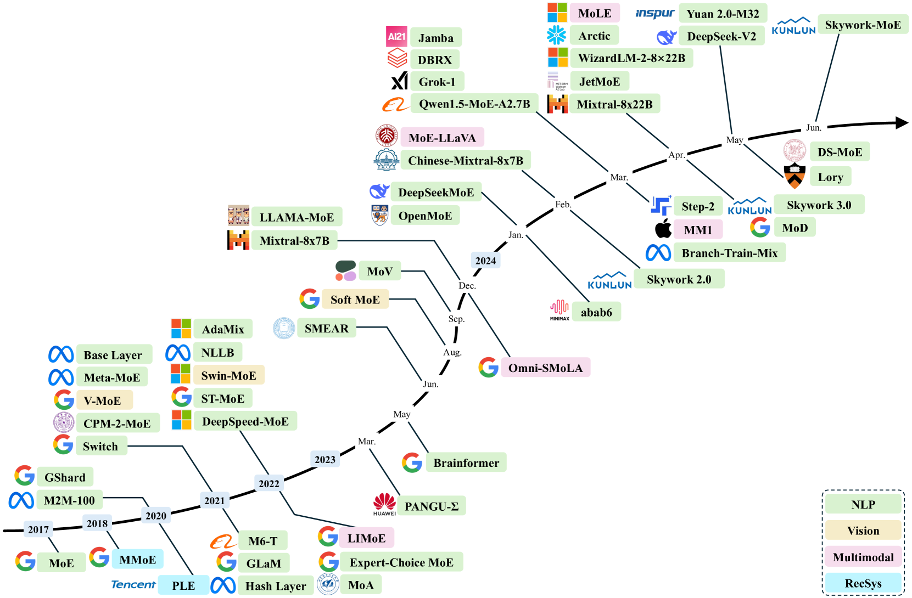
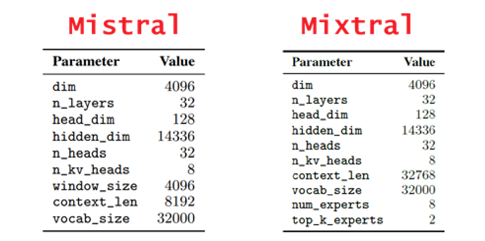
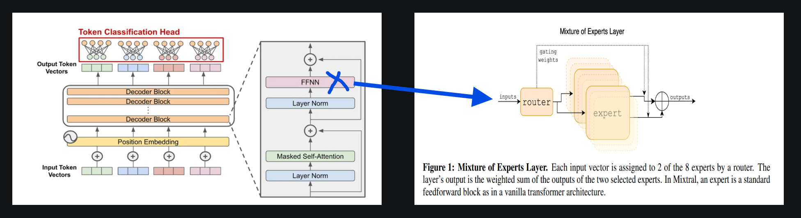

# Week 7 - MoE and the Mixtral of Experts Paper

### What is Mixture of Experts (MoE)? 
Mixture of Experts is a model that contains expert sub networks within the entire model. The main idea behind is to have parts of the model specialized on certain domains/tasks/skills, therefore increase quality with the same amount of computation.

In deep learning models, it appears that the existing approaches reuse the same parameters for all the inputs. MoE models change this by selecting different parameters for each input based on gating mechanisms.

### What are the benefits of MoE?
- increased model capacity with same compute
- sparsely activated experts, less noise

### What challenges does MoE architectures face?
- large dataset requirements, prone to overfit
- more VRAM, memory intensive, all experts to be loaded to the memory even if not used
- additional complexity in design
- harder to finetune

## Literature Recap/Review

MoEs were introduced back in 1991 and attempts in the modern era with big data allowed experimenting further with MoE. People have found efficient ways to integrate MoE designs that lead to state of the art performances.

- [Twenty Years of Mixture of Experts (2012)](https://www.researchgate.net/publication/260707711_Twenty_Years_of_Mixture_of_Experts)
    - Historical development of MoE
- [A Survey on Mixture of Experts (2024)](https://arxiv.org/html/2407.06204v2)
    - MoE in modern era, below is the figure 1 showing several representative MoE models in recent years.

  

Few example contributions:
- [Adaptive Mixture of Local Experts (1991)](https://www.cs.toronto.edu/~hinton/absps/jjnh91.pdf)
    - Introduced the concept with systems composed of many separate expert networks.
- [Outrageously Large Neural Networks: The Sparsely-Gated Mixture-of-Experts Layer (2017)](https://arxiv.org/abs/1701.06538)
    - Introduced the concept to the modern era with gated MoE feed-forward networks between LSTM layers, (pre-transformer)
- [Expert Gate: Lifelong Learning with a Network of Experts (2017)](https://arxiv.org/abs/1611.06194)
    -  New tasks / experts are learned and added to the model sequentially
- [Switch Transformers: Scaling to Trillion Parameter Models with Simple and Efficient Sparsity (2021)](https://arxiv.org/abs/2101.03961)
    - Based on T5, converts dense FFN layer in Transformer with a sparse Switch FFN layer with separate routers
- [Mixtral of Experts (2024)](https://arxiv.org/abs/2401.04088)
    - MoE applied to every layer, replaced FFN blocks in each transformer block.

## Mixtral of Experts

Mixtral is a transformer based model that uses the same modifications of Mistral 7B, with increased context length and replacement of feed forward blocks with Mixture-of-Expert layers.

  

Mixtral 8x7B (~Mistral 7B with 8 experts + 32k context length)

8 experts (2 activated in each forward pass)

inference ~13B (2x7B - shared parameters)

full model ~47B (8x7B - shared parameters)

It is noted as the first MoE network that demonstrates state-of-the-art performance among open-source models. Matches or exceeds previous best 70B-parameter models (Llama2) despite using only 13B active parameters per token.

The key difference and contribution of this MoE implementation is replacing the FFN/FFNNs **in each** decoder only transformer block with the MoEs. This demonstrated significantly increased model capacity with the same computation.

  

Table below starts by showing the representation of the MoE layer. Drills down into components G(x) and E(x) and rolls back to the MoE layer representation again at the last row.

| equation | represents |
|:---------:|:---------:|
| $$y = \sum_{i=0}^{n-1} G(x)_i \cdot E_i(x)$$ | MoE Layer |
| $$G(x) := \text{Softmax}(\text{TopK}(x \cdot W_g))$$ | gating function |
| $$E(x) := \text{SwiGLU}(x) := W_{down} \left( \text{Swish}(W_{gate} x) \odot W_{up} x \right)$$ | expert function |
| $$y = \sum_{i=0}^{n-1} \text{Softmax}(\text{Top2}(x \cdot W_g))_i \cdot \text{SwiGLU}_i(x)$$ | MoE Layer |
| $$y = \sum_{i=0}^{n-1} G(x)_i \cdot E_i(x)$$ | MoE Layer |

## Useful Links
- [Decoder-Only Transformers: The Workhorse of Generative LLMs](https://cameronrwolfe.substack.com/p/decoder-only-transformers-the-workhorse)
- [Choice of Activation Functions (ReLU, GeLU, SwiGLU)](https://apxml.com/courses/how-to-build-a-large-language-model/chapter-11-scaling-transformers-architectural-choices/choice-activation-functions)
- [Introduction to Mixture of Experts (MoE)](https://apxml.com/courses/how-to-build-a-large-language-model/chapter-14-advanced-architectural-modifications/introduction-mixture-of-experts-moe)
- [Mixture of Experts: Core Concepts and Hands-on Implementation](https://apxml.com/courses/mixture-of-experts-advanced-implementation)
- [Replacing FFNs with MoE Layers in Transformers](https://apxml.com/courses/mixture-of-experts-advanced-implementation/chapter-5-integrating-moe-into-architectures/replacing-ffn-with-moe)
- [What is SwiGLU?](https://jcarlosroldan.com/post/348)
- [A Guide to Softmax Activation Function](https://www.singlestore.com/blog/a-guide-to-softmax-activation-function/)
- [Mixture-of-Experts (MoE): The Birth and Rise of Conditional Computation](https://cameronrwolfe.substack.com/p/conditional-computation-the-birth)
